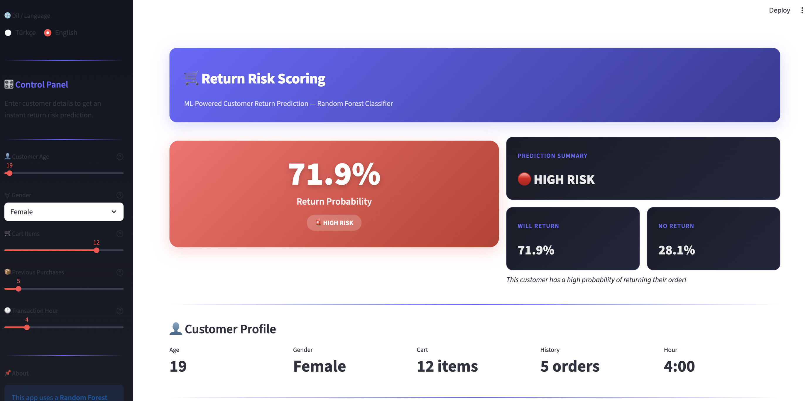
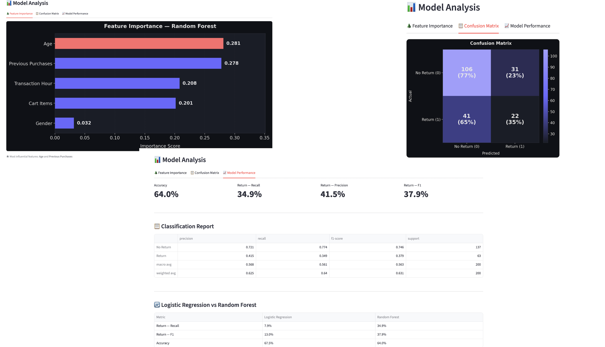

#  E-Commerce Return Risk Predictor

This project is a Machine Learning Proof of Concept (PoC) designed to help e-commerce store owners minimize financial losses by predicting the probability of product returns before checkout.

###  The Business Problem
Product returns are one of the biggest profit killers in e-commerce. If a seller knows a cart has a high probability of being returned (e.g., %75 risk), they can dynamically adjust "Free Return" policies or flag the order.

###  Statistical Approach & Overcoming Class Imbalance
As a data-driven developer, my focus was building a robust model. E-commerce return data is inherently **imbalanced** (most people don't return items). 

* **Initial Model (Logistic Regression):** Achieved 67% accuracy but failed to catch actual returns (Only 7.9% Recall).
* **Final Model (Random Forest with Balanced Weights):** By applying `class_weight='balanced'`, I boosted the **Recall rate to 34.9%**. This means the model is now 4.4x better at catching real financial risks!

### 💻 Interactive Web Interface
I built a bilingual (TR/EN) interactive web interface using Streamlit so non-technical users can test the model easily. 

*(Risk Skorlama Arayüzü)*

*(Model Analizi ve Karmaşıklık Matrisi)*

### 📊 Full Project Report
For detailed feature importance analysis and confusion matrix breakdowns, you can review the full PDF report here: [Project Summary Report](return-risk-pdf.pdf)

###  How to Run Locally
1. Clone the repository.
2. Install requirements: `pip install streamlit pandas scikit-learn`
3. Run the app: `streamlit run app.py`
